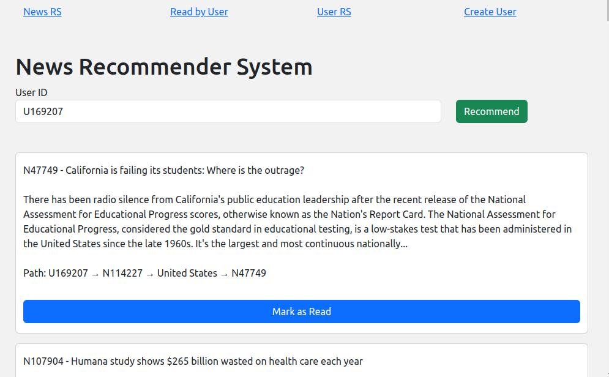

# news-recommender-system

This work seeks to use the technique of creating knowledge graphs to recommend news and users. A knowledge graph was built from the MIND dataset through an initial pre-processing and storing it in a Neo4j database, which is based on graphs. After that, queries and an interaction interface for news and user recommendation were developed.

Currently, news and users are recommended simply by searching first-level nearby nodes. More complex methods could be implemented using the same knowledge graph.

### Knowledge graph structure example (Neo4j query)

### News RS interface

### Users RS interface

This project was developed for the Database Project course at [INF](https://inf.ufrgs.br)-[UFRGS](https://ufrgs.br).
